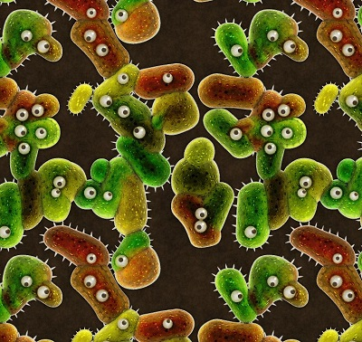

# Belly Button Biodiversity

Built an interactive dashboard to explore the [Belly Button Biodiversity DataSet](http://robdunnlab.com/projects/belly-button-biodiversity/).

## Step 1 - Plotly.js

Used Plotly.js to build interactive charts for the dashboard that updates all of the plots any time a new sample is selected.

## Step 2 - Heroku

Deployed the Flask app to Heroku.